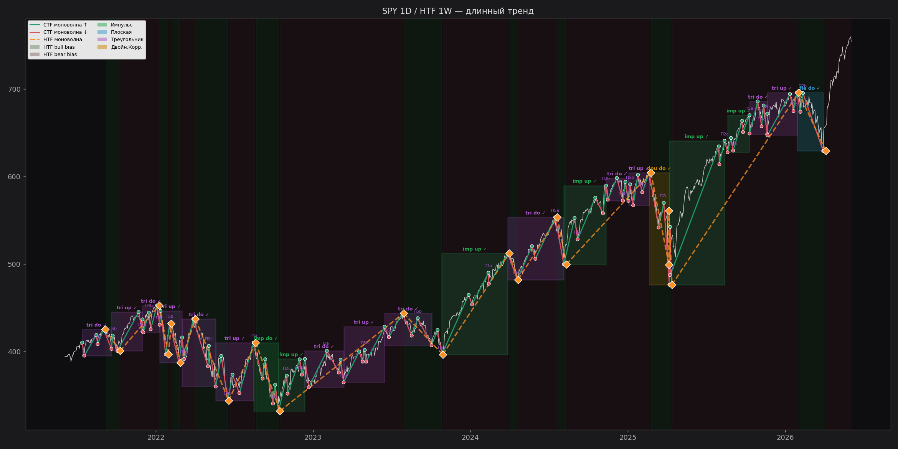
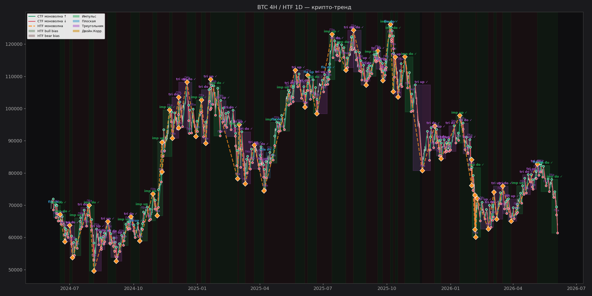
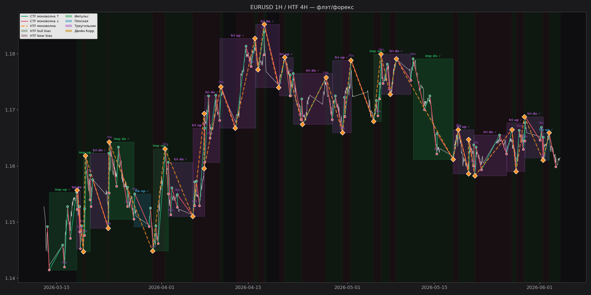
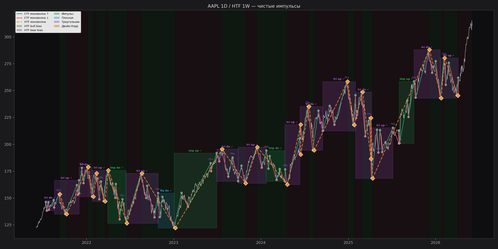
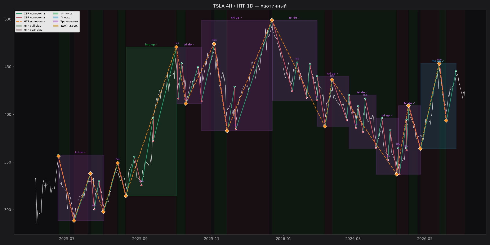
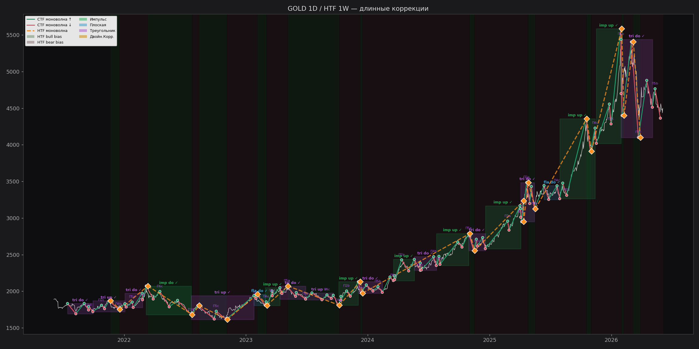
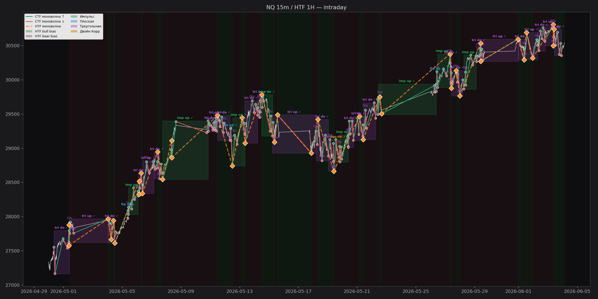
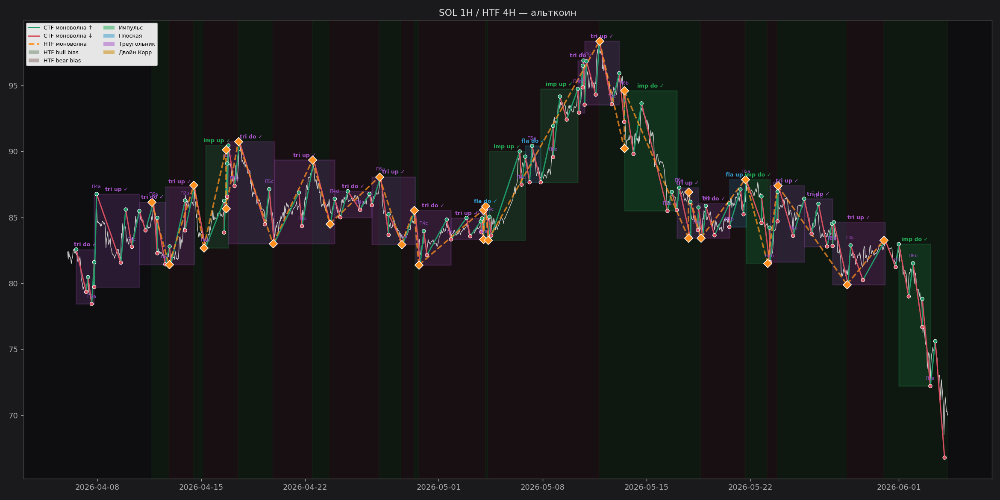

# Спринт 0 — Авто-валидация (Python)

**Сгенерировано автоматически:** `python/scripts/validate_sprint0.py`
**Дата:** 2026-06-04 10:15

## Сводка по тикерам

| Тикер / ТФ | Баров | CTF пив | HTF пив | Имп | Флэт | Треуг | DC | Всего | ✓Подтв. | Rate | HTF bias |
|---|---|---|---|---|---|---|---|---|---|---|---|
| SPY 1D / HTF 1W — длинный трен | 1255 | 110 | 22 | 6 | 1 | 14 | 1 | 22 | 22 | 100% | ▼ |
| BTC 4H / HTF 1D — крипто-тренд | 4342 | 426 | 59 | 26 | 8 | 50 | 0 | 84 | 84 | 100% | ▲ |
| EURUSD 1H / HTF 4H — флэт/форе | 1403 | 120 | 35 | 6 | 2 | 15 | 0 | 23 | 23 | 100% | ▲ |
| AAPL 1D / HTF 1W — чистые импу | 1255 | 96 | 28 | 4 | 1 | 14 | 0 | 19 | 19 | 100% | ▼ |
| TSLA 4H / HTF 1D — хаотичный | 499 | 51 | 18 | 1 | 1 | 8 | 0 | 10 | 10 | 100% | ▼ |
| GOLD 1D / HTF 1W — длинные кор | 1258 | 110 | 24 | 8 | 2 | 11 | 0 | 21 | 21 | 100% | ▼ |
| NQ 15m / HTF 1H — intraday | 2171 | 190 | 41 | 8 | 3 | 26 | 1 | 38 | 38 | 100% | ▲ |
| SOL 1H / HTF 4H — альткоин | 1411 | 132 | 29 | 6 | 3 | 17 | 0 | 26 | 26 | 100% | ▲ |

## Итог

- Всего распознано фигур: **243**
- Из них подтверждено (passed Error-rules): **243**
- Confirm rate: **100.0%**

**Gate Спринта 0:**

- ✅ ≥70% подтверждённых фигур → переход в Спринт 1 (HTF bias UI)
- ⚠ 50-70% → Спринт 0.5: тюнинг ATR multiplier / диагностика ошибок
- ❌ <50% → пересмотр алгоритма

---

## SPY 1D / HTF 1W — длинный тренд

- Период: `2021-06-04 → 2026-06-03` (1255 баров)
- CTF моноволн: **110**, HTF моноволн: **22**
- Финальный HTF bias: **-1** (WEAK BEAR)

| Тип фигуры | Всего | Подтверждено | Rate |
|---|---|---|---|
| impulse | 6 | 6 | 100% |
| flat | 1 | 1 | 100% |
| triangle | 14 | 14 | 100% |
| double_corr | 1 | 1 | 100% |
| **ВСЕГО** | **22** | **22** | **100%** |

## BTC 4H / HTF 1D — крипто-тренд

- Период: `2024-06-04 → 2026-06-04` (4342 баров)
- CTF моноволн: **426**, HTF моноволн: **59**
- Финальный HTF bias: **1** (WEAK BULL)

| Тип фигуры | Всего | Подтверждено | Rate |
|---|---|---|---|
| impulse | 26 | 26 | 100% |
| flat | 8 | 8 | 100% |
| triangle | 50 | 50 | 100% |
| double_corr | 0 | 0 | 0% |
| **ВСЕГО** | **84** | **84** | **100%** |

## EURUSD 1H / HTF 4H — флэт/форекс

- Период: `2026-03-13 → 2026-06-04` (1403 баров)
- CTF моноволн: **120**, HTF моноволн: **35**
- Финальный HTF bias: **1** (WEAK BULL)

| Тип фигуры | Всего | Подтверждено | Rate |
|---|---|---|---|
| impulse | 6 | 6 | 100% |
| flat | 2 | 2 | 100% |
| triangle | 15 | 15 | 100% |
| double_corr | 0 | 0 | 0% |
| **ВСЕГО** | **23** | **23** | **100%** |

## AAPL 1D / HTF 1W — чистые импульсы

- Период: `2021-06-04 → 2026-06-03` (1255 баров)
- CTF моноволн: **96**, HTF моноволн: **28**
- Финальный HTF bias: **-1** (WEAK BEAR)

| Тип фигуры | Всего | Подтверждено | Rate |
|---|---|---|---|
| impulse | 4 | 4 | 100% |
| flat | 1 | 1 | 100% |
| triangle | 14 | 14 | 100% |
| double_corr | 0 | 0 | 0% |
| **ВСЕГО** | **19** | **19** | **100%** |

## TSLA 4H / HTF 1D — хаотичный

- Период: `2025-06-04 → 2026-06-03` (499 баров)
- CTF моноволн: **51**, HTF моноволн: **18**
- Финальный HTF bias: **-1** (WEAK BEAR)

| Тип фигуры | Всего | Подтверждено | Rate |
|---|---|---|---|
| impulse | 1 | 1 | 100% |
| flat | 1 | 1 | 100% |
| triangle | 8 | 8 | 100% |
| double_corr | 0 | 0 | 0% |
| **ВСЕГО** | **10** | **10** | **100%** |

## GOLD 1D / HTF 1W — длинные коррекции

- Период: `2021-06-04 → 2026-06-04` (1258 баров)
- CTF моноволн: **110**, HTF моноволн: **24**
- Финальный HTF bias: **-1** (WEAK BEAR)

| Тип фигуры | Всего | Подтверждено | Rate |
|---|---|---|---|
| impulse | 8 | 8 | 100% |
| flat | 2 | 2 | 100% |
| triangle | 11 | 11 | 100% |
| double_corr | 0 | 0 | 0% |
| **ВСЕГО** | **21** | **21** | **100%** |

## NQ 15m / HTF 1H — intraday

- Период: `2026-04-30 → 2026-06-04` (2171 баров)
- CTF моноволн: **190**, HTF моноволн: **41**
- Финальный HTF bias: **1** (WEAK BULL)

| Тип фигуры | Всего | Подтверждено | Rate |
|---|---|---|---|
| impulse | 8 | 8 | 100% |
| flat | 3 | 3 | 100% |
| triangle | 26 | 26 | 100% |
| double_corr | 1 | 1 | 100% |
| **ВСЕГО** | **38** | **38** | **100%** |

## SOL 1H / HTF 4H — альткоин

- Период: `2026-04-06 → 2026-06-04` (1411 баров)
- CTF моноволн: **132**, HTF моноволн: **29**
- Финальный HTF bias: **1** (WEAK BULL)

| Тип фигуры | Всего | Подтверждено | Rate |
|---|---|---|---|
| impulse | 6 | 6 | 100% |
| flat | 3 | 3 | 100% |
| triangle | 17 | 17 | 100% |
| double_corr | 0 | 0 | 0% |
| **ВСЕГО** | **26** | **26** | **100%** |

