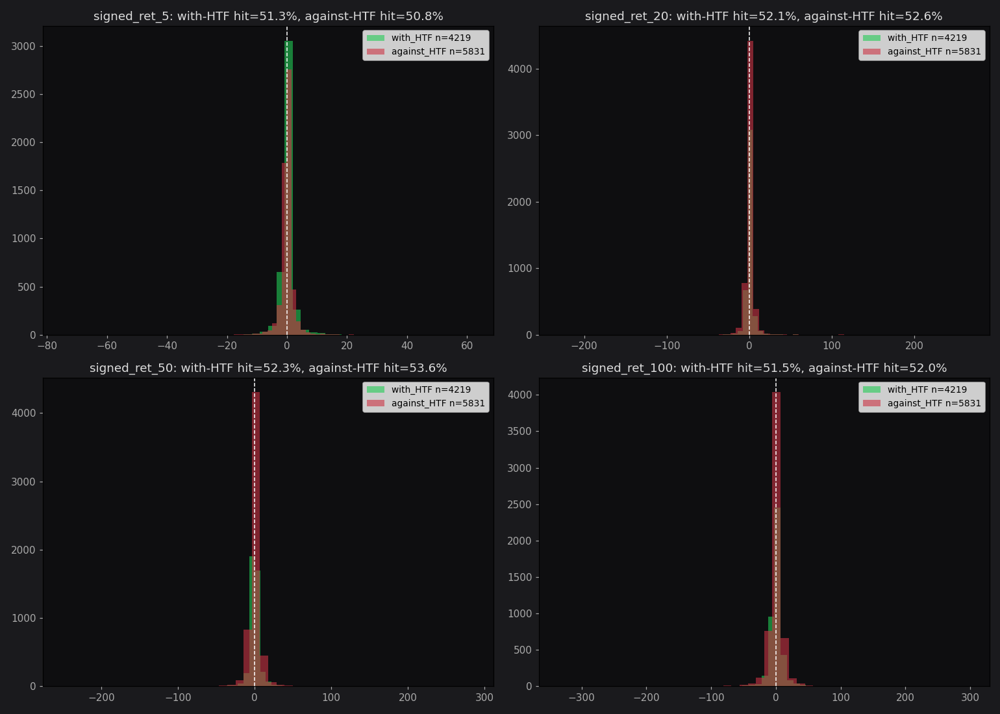

# Спринт 4 — Wide Edge Discovery

**Дата:** 2026-06-04 10:45
**Датасет:** 10397 фигур, 58 тикеров, ТФ: ['1d', '1h']

**Распределение по типам:**

- triangle: 6418
- impulse: 2939
- flat: 921
- double_corr: 119

## H0 — Baseline (без фильтра)

| Горизонт | n | hit_rate | mean_ret | Sharpe | p-value |
|---|---|---|---|---|---|
| 5 | 10397 | 51.1% | 0.04% | 0.015 | 0.1335 |
| 10 | 10397 | 52.0% | 0.09% | 0.021 | 0.0297 |
| 20 | 10397 | 52.5% | 0.26% | 0.038 | 0.0001 |
| 50 | 10397 | 53.1% | 0.52% | 0.050 | 0.0000 |
| 100 | 10397 | 51.8% | 0.41% | 0.027 | 0.0058 |

## H1 — По типу фигуры × горизонту (без HTF фильтра)

### Горизонт 5 баров

| fig_type    |    n | hit_rate   | mean_ret   |   sharpe |   t_stat |   p_value |
|:------------|-----:|:-----------|:-----------|---------:|---------:|----------:|
| double_corr |  119 | 57.98%     | 0.69%      |    0.261 |    2.842 |     0.005 |
| flat        |  921 | 57.65%     | 0.53%      |    0.151 |    4.582 |     0     |
| triangle    | 6418 | 50.67%     | 0.0%       |    0.001 |    0.056 |     0.955 |
| impulse     | 2939 | 49.81%     | -0.06%     |   -0.024 |   -1.328 |     0.184 |

### Горизонт 10 баров

| fig_type    |    n | hit_rate   | mean_ret   |   sharpe |   t_stat |   p_value |
|:------------|-----:|:-----------|:-----------|---------:|---------:|----------:|
| double_corr |  119 | 74.79%     | 1.56%      |    0.374 |    4.081 |     0     |
| flat        |  921 | 60.69%     | 0.87%      |    0.162 |    4.924 |     0     |
| triangle    | 6418 | 51.14%     | 0.01%      |    0.003 |    0.23  |     0.818 |
| impulse     | 2939 | 50.19%     | -0.05%     |   -0.013 |   -0.709 |     0.479 |

### Горизонт 20 баров

| fig_type    |    n | hit_rate   | mean_ret   |   sharpe |   t_stat |   p_value |
|:------------|-----:|:-----------|:-----------|---------:|---------:|----------:|
| double_corr |  119 | 89.08%     | 3.91%      |    0.372 |    4.059 |     0     |
| flat        |  921 | 63.3%      | 1.73%      |    0.154 |    4.685 |     0     |
| triangle    | 6418 | 51.26%     | 0.19%      |    0.034 |    2.705 |     0.007 |
| impulse     | 2939 | 50.36%     | -0.22%     |   -0.035 |   -1.908 |     0.056 |

### Горизонт 50 баров

| fig_type    |    n | hit_rate   | mean_ret   |   sharpe |   t_stat |   p_value |
|:------------|-----:|:-----------|:-----------|---------:|---------:|----------:|
| double_corr |  119 | 93.28%     | 8.12%      |    0.533 |    5.816 |     0     |
| flat        |  921 | 59.5%      | 2.53%      |    0.138 |    4.198 |     0     |
| impulse     | 2939 | 52.88%     | -0.16%     |   -0.018 |   -0.985 |     0.325 |
| triangle    | 6418 | 51.53%     | 0.4%       |    0.044 |    3.526 |     0     |

### Горизонт 100 баров

| fig_type    |    n | hit_rate   | mean_ret   |   sharpe |   t_stat |   p_value |
|:------------|-----:|:-----------|:-----------|---------:|---------:|----------:|
| double_corr |  119 | 83.19%     | 9.93%      |    0.532 |    5.805 |     0     |
| flat        |  921 | 54.94%     | 2.4%       |    0.093 |    2.829 |     0.005 |
| triangle    | 6418 | 51.29%     | 0.36%      |    0.026 |    2.066 |     0.039 |
| impulse     | 2939 | 50.73%     | -0.5%      |   -0.041 |   -2.203 |     0.028 |

## H2 — HTF bias фильтр (главный тест)

### Горизонт 10 баров

| fig_type    | with_htf   |    n | hit_rate   | mean_ret   |   sharpe |   t_stat |   p_value |
|:------------|:-----------|-----:|:-----------|:-----------|---------:|---------:|----------:|
| double_corr | False      |   86 | 73.26%     | 1.56%      |    0.337 |    3.123 |     0.002 |
| double_corr | True       |   33 | 78.79%     | 1.58%      |    0.576 |    3.311 |     0.002 |
| flat        | False      |  397 | 63.73%     | 0.83%      |    0.23  |    4.583 |     0     |
| flat        | True       |  524 | 58.4%      | 0.91%      |    0.141 |    3.239 |     0.001 |
| impulse     | False      | 2488 | 49.56%     | -0.09%     |   -0.023 |   -1.169 |     0.243 |
| impulse     | True       |  451 | 53.66%     | 0.18%      |    0.05  |    1.066 |     0.287 |
| triangle    | False      | 3207 | 51.92%     | 0.01%      |    0.002 |    0.132 |     0.895 |
| triangle    | True       | 3211 | 50.36%     | 0.01%      |    0.004 |    0.209 |     0.835 |

### Горизонт 20 баров

| fig_type    | with_htf   |    n | hit_rate   | mean_ret   |   sharpe |   t_stat |   p_value |
|:------------|:-----------|-----:|:-----------|:-----------|---------:|---------:|----------:|
| double_corr | False      |   86 | 89.53%     | 4.37%      |    0.361 |    3.345 |     0.001 |
| double_corr | True       |   33 | 87.88%     | 2.71%      |    0.693 |    3.981 |     0     |
| flat        | False      |  397 | 64.74%     | 1.79%      |    0.213 |    4.251 |     0     |
| flat        | True       |  524 | 62.21%     | 1.7%       |    0.13  |    2.985 |     0.003 |
| impulse     | False      | 2488 | 49.48%     | -0.29%     |   -0.045 |   -2.22  |     0.027 |
| impulse     | True       |  451 | 55.21%     | 0.16%      |    0.035 |    0.744 |     0.457 |
| triangle    | False      | 3207 | 52.82%     | 0.21%      |    0.03  |    1.702 |     0.089 |
| triangle    | True       | 3211 | 49.7%      | 0.18%      |    0.042 |    2.365 |     0.018 |

### Горизонт 50 баров

| fig_type    | with_htf   |    n | hit_rate   | mean_ret   |   sharpe |   t_stat |   p_value |
|:------------|:-----------|-----:|:-----------|:-----------|---------:|---------:|----------:|
| double_corr | False      |   86 | 95.35%     | 8.83%      |    0.506 |    4.692 |     0     |
| double_corr | True       |   33 | 87.88%     | 6.27%      |    0.97  |    5.571 |     0     |
| flat        | False      |  397 | 59.7%      | 3.2%       |    0.149 |    2.978 |     0.003 |
| flat        | True       |  524 | 59.35%     | 2.02%      |    0.13  |    2.984 |     0.003 |
| impulse     | False      | 2488 | 51.61%     | -0.27%     |   -0.031 |   -1.526 |     0.127 |
| impulse     | True       |  451 | 59.87%     | 0.46%      |    0.058 |    1.242 |     0.215 |
| triangle    | False      | 3207 | 53.32%     | 0.71%      |    0.067 |    3.786 |     0     |
| triangle    | True       | 3211 | 49.74%     | 0.09%      |    0.013 |    0.709 |     0.478 |

## H3 — Различия между таймфреймами

С HTF фильтром, h=20:

| fig_type   | interval   |    n | hit_rate   | mean_ret   |   sharpe |   t_stat |   p_value |
|:-----------|:-----------|-----:|:-----------|:-----------|---------:|---------:|----------:|
| flat       | 1d         |   45 | 57.78%     | 9.67%      |    0.23  |    1.541 |     0.13  |
| flat       | 1h         |  479 | 62.63%     | 0.95%      |    0.242 |    5.302 |     0     |
| impulse    | 1d         |   32 | 40.62%     | -1.46%     |   -0.157 |   -0.886 |     0.383 |
| impulse    | 1h         |  419 | 56.32%     | 0.29%      |    0.07  |    1.44  |     0.151 |
| triangle   | 1d         |  304 | 50.99%     | 0.74%      |    0.07  |    1.218 |     0.224 |
| triangle   | 1h         | 2907 | 49.57%     | 0.12%      |    0.041 |    2.192 |     0.028 |

## H4 — Walk-forward (5 окон по времени)

|   fold | period                  | fig_type   |   n | hit_rate   | mean_ret   |   p_value |
|-------:|:------------------------|:-----------|----:|:-----------|:-----------|----------:|
|      0 | 2021-07-24 → 2024-04-12 | impulse    |  48 | 45.83%     | -0.31%     |     0.694 |
|      0 | 2021-07-24 → 2024-04-12 | triangle   | 559 | 50.81%     | 0.05%      |     0.827 |
|      0 | 2021-07-24 → 2024-04-12 | flat       | 100 | 65.0%      | 1.23%      |     0.163 |
|      1 | 2024-04-12 → 2024-10-31 | impulse    |  86 | 56.98%     | 0.34%      |     0.433 |
|      1 | 2024-04-12 → 2024-10-31 | triangle   | 640 | 51.56%     | 0.18%      |     0.144 |
|      1 | 2024-04-12 → 2024-10-31 | flat       | 109 | 69.72%     | 1.66%      |     0.001 |
|      2 | 2024-10-31 → 2025-05-05 | impulse    | 100 | 56.0%      | -0.12%     |     0.801 |
|      2 | 2024-10-31 → 2025-05-05 | triangle   | 709 | 46.12%     | 0.31%      |     0.147 |
|      2 | 2024-10-31 → 2025-05-05 | flat       | 103 | 56.31%     | 3.39%      |     0.197 |
|      3 | 2025-05-05 → 2025-11-07 | impulse    |  95 | 52.63%     | 0.58%      |     0.119 |
|      3 | 2025-05-05 → 2025-11-07 | triangle   | 639 | 50.7%      | 0.11%      |     0.373 |
|      3 | 2025-05-05 → 2025-11-07 | flat       | 103 | 54.37%     | 1.38%      |     0.016 |
|      4 | 2025-11-07 → 2026-05-30 | impulse    | 122 | 59.02%     | 0.14%      |     0.785 |
|      4 | 2025-11-07 → 2026-05-30 | triangle   | 664 | 49.85%     | 0.24%      |     0.075 |
|      4 | 2025-11-07 → 2026-05-30 | flat       | 109 | 65.14%     | 0.85%      |     0.072 |

## H5 — Влияние размера фигуры

Edge по квартилям амплитуды (с HTF):

| fig_type   | amp_q    |    n | hit_rate   | mean_ret   |   sharpe |   t_stat |   p_value |
|:-----------|:---------|-----:|:-----------|:-----------|---------:|---------:|----------:|
| flat       | Q1_small |  204 | 61.76%     | 0.35%      |    0.13  |    1.857 |     0.065 |
| flat       | Q2       |  201 | 62.69%     | 2.63%      |    0.137 |    1.941 |     0.054 |
| flat       | Q3       |   92 | 60.87%     | 1.67%      |    0.33  |    3.164 |     0.002 |
| flat       | Q4_large |   27 | 66.67%     | 5.03%      |    0.256 |    1.331 |     0.195 |
| impulse    | Q1_small |   55 | 45.45%     | 0.03%      |    0.058 |    0.43  |     0.669 |
| impulse    | Q2       |   48 | 58.33%     | 0.38%      |    0.206 |    1.429 |     0.159 |
| impulse    | Q3       |  151 | 56.29%     | -0.06%     |   -0.022 |   -0.267 |     0.79  |
| impulse    | Q4_large |  197 | 56.35%     | 0.32%      |    0.049 |    0.686 |     0.494 |
| triangle   | Q1_small | 1345 | 47.29%     | 0.08%      |    0.024 |    0.88  |     0.379 |
| triangle   | Q2       | 1030 | 52.04%     | 0.07%      |    0.023 |    0.724 |     0.47  |
| triangle   | Q3       |  546 | 50.73%     | 0.43%      |    0.097 |    2.276 |     0.023 |
| triangle   | Q4_large |  290 | 50.69%     | 0.59%      |    0.063 |    1.065 |     0.288 |

## Финальный вердикт

**Статистически значимый edge (p<0.05, hit>55%, с HTF фильтром):**

| Гориз | fig_type | n | hit_rate | mean_ret | Sharpe | p |
|---|---|---|---|---|---|---|
| 20 | flat | 524 | 62.2% | 1.70% | 0.130 | 0.0030 |
| 50 | flat | 524 | 59.4% | 2.02% | 0.130 | 0.0030 |
| 10 | flat | 524 | 58.4% | 0.91% | 0.141 | 0.0013 |
| 5 | flat | 524 | 55.9% | 0.54% | 0.132 | 0.0027 |

**Gate Спринта 4 пройден.** Edge подтверждён на n≥50, p<0.05, hit≥55%.
Переход в Спринт 5 (baseline ML).

