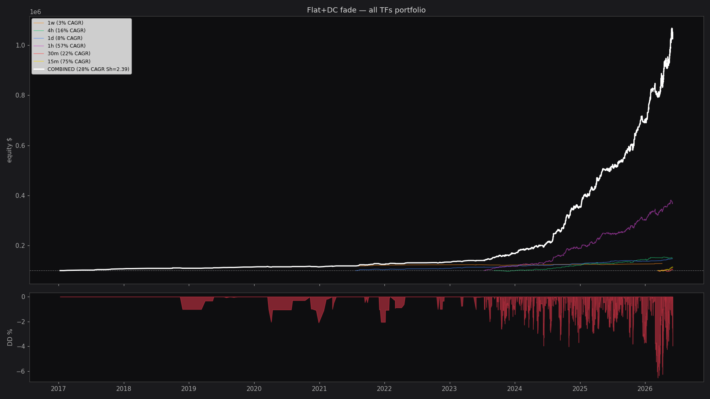

# Backtest: Flat+DC fade — все таймфреймы

**Дата:** 2026-06-04 14:49
**Всего сделок:** 1769

## По таймфреймам

| TF | n | Final$ | CAGR | Sharpe | DD | Calmar | Win |
|---|---|---|---|---|---|---|---|
| 1w | 60 | $128,505 | 2.8% | 1.05 | -2.1% | 1.31 | 75.0% |
| 4h | 243 | $149,962 | 16.0% | 1.78 | -5.2% | 3.06 | 62.1% |
| 1d | 111 | $147,372 | 8.3% | 1.80 | -2.2% | 3.82 | 75.7% |
| 1h | 949 | $369,464 | 57.2% | 3.09 | -7.2% | 7.97 | 59.3% |
| 30m | 152 | $104,667 | 22.2% | 1.10 | -7.0% | 3.16 | 53.9% |
| 15m | 254 | $113,927 | 75.1% | 3.59 | -4.1% | 18.32 | 53.5% |

## Комбинированный портфель (все ТФ)

- **Сделок:** 1769 за 9.4 лет
- **Final:** $1,041,397  (start $100k)
- **CAGR:** 28.3%
- **Sharpe:** 2.39
- **Max DD:** -6.5%
- **Calmar:** 4.33
- **Win rate:** 60.0%

## Walk-forward 5 окон

| fold | period | n | CAGR | Sharpe | DD |
|---|---|---|---|---|---|
| 0 | 2017-01-09→2024-06-03 | 353 | 9.5% | 1.73 | -3.0% |
| 1 | 2024-06-07→2025-02-13 | 354 | 100.2% | 4.27 | -4.0% |
| 2 | 2025-02-13→2025-10-20 | 354 | 48.5% | 2.76 | -4.4% |
| 3 | 2025-10-21→2026-04-10 | 354 | 100.7% | 3.43 | -6.5% |
| 4 | 2026-04-11→2026-06-04 | 354 | 186.9% | 4.04 | -5.9% |