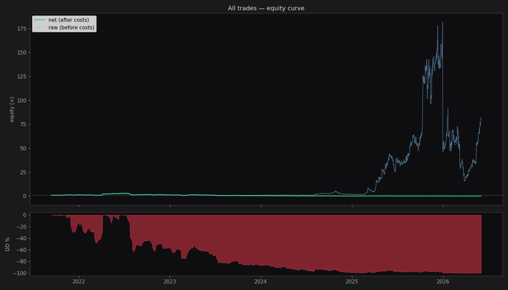
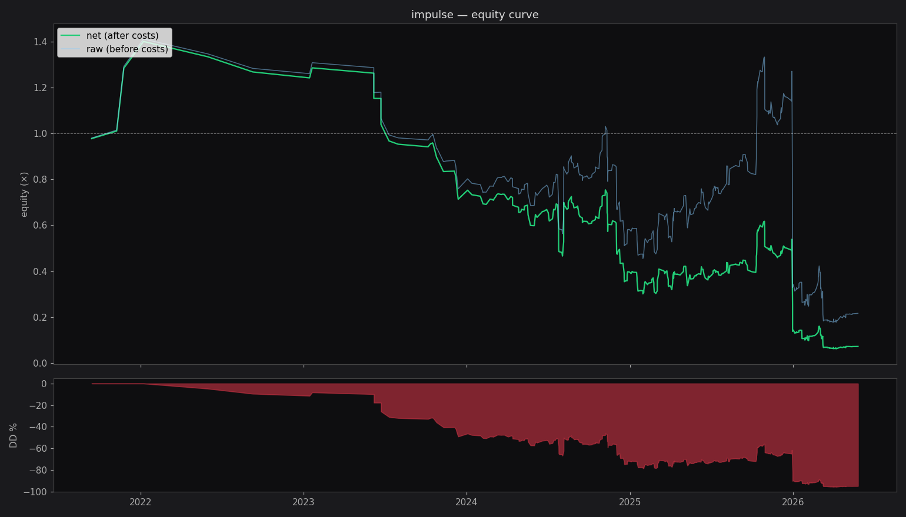
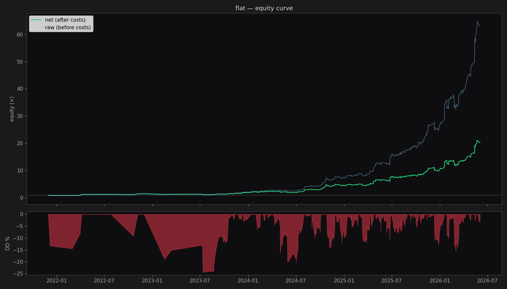
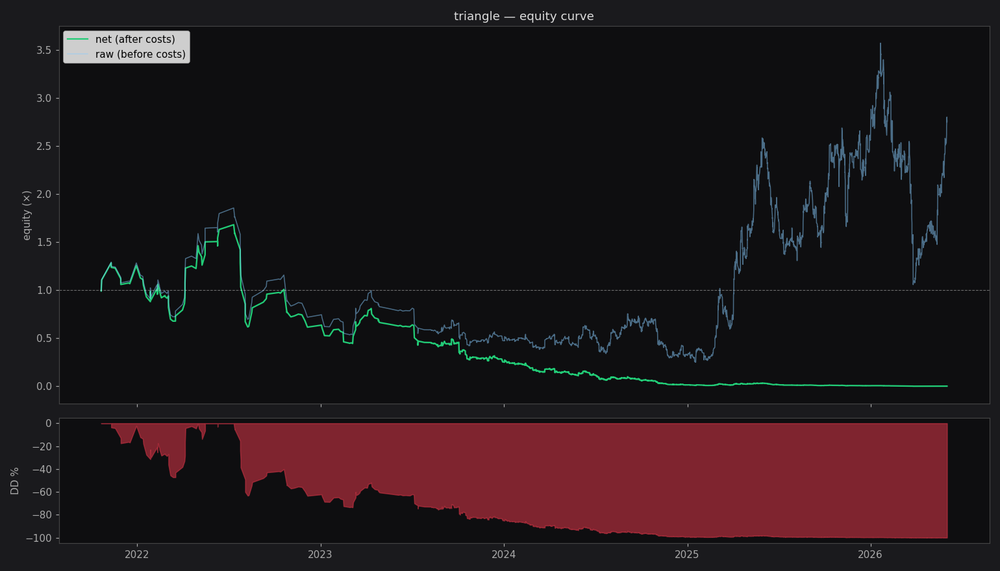
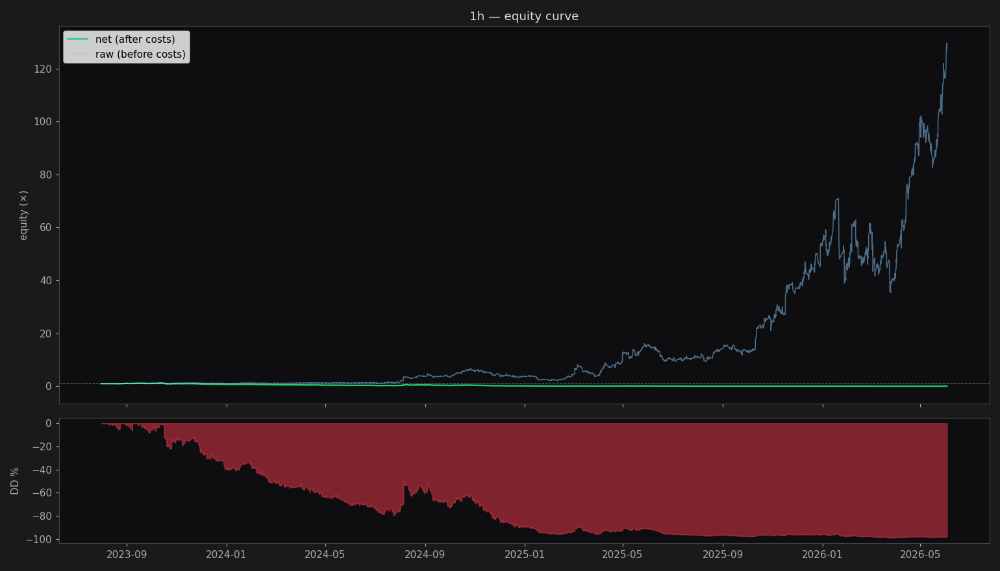
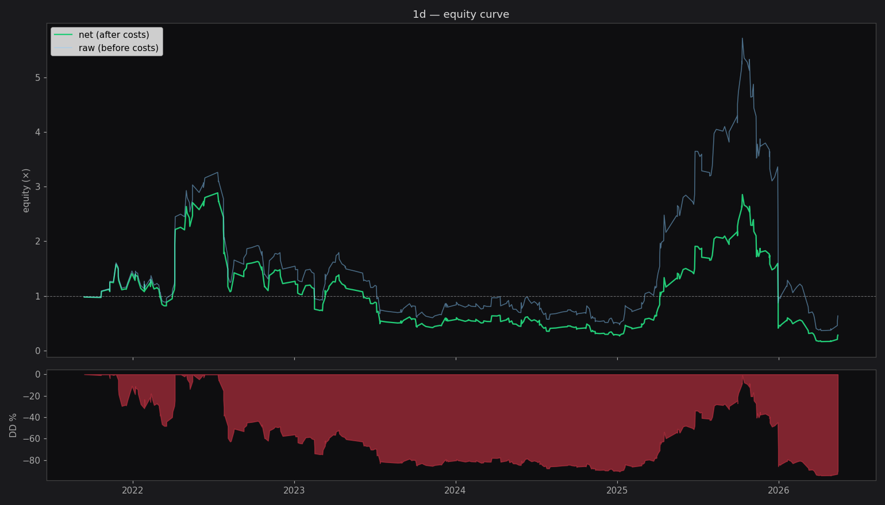

# Спринт 6 — Backtest «fade with HTF»

**Дата:** 2026-06-04 10:46
**Сделок:** 4282

## Стратегия

**Вход:** в конце фигуры (entry_idx=confirmation бар), ТОЛЬКО если фигура совпадает с HTF биасом (with_htf=True).
- HTF bull + figure UP → **SHORT** (ожидаем коррекция Эллиота вниз)
- HTF bear + figure DOWN → **LONG**

**Выход:** первый из трёх
- TP = вход − amplitude (полный ретрейс фигуры в обратную сторону)
- SL = вход + amplitude (фигура продолжается)
- Time exit = 20 баров

**Комиссии:** stocks/ETF — 0.08% per side; crypto/FX/commodities — 0.13% per side.

## Общая статистика

n=4282, win=43.7%, mean=-0.05%, total=-99.4%, DD=-99.9%, Sharpe~-0.22, PF=0.95, avg W/L=2.19%/-1.79%

## По типу фигуры

| fig_type | n | win% | mean_net | total | DD | PF | Sharpe~ |
|---|---|---|---|---|---|---|---|
| double_corr | 33 | 84.8% | 2.19% | 100.3% | -4.0% | 6.71 | 9.33 |
| flat | 531 | 56.1% | 0.63% | 1932.6% | -24.4% | 1.89 | 2.76 |
| impulse | 455 | 47.9% | -0.38% | -92.8% | -95.6% | 0.78 | -1.04 |
| triangle | 3263 | 40.7% | -0.14% | -99.8% | -99.9% | 0.86 | -0.70 |

## По таймфрейму

| interval | n | win% | mean_net | total | DD | PF |
|---|---|---|---|---|---|---|
| 1d | 406 | 49.0% | 0.14% | -71.9% | -94.3% | 1.05 |
| 1h | 3876 | 43.2% | -0.07% | -97.8% | -98.9% | 0.91 |

## По стороне (long vs short)

| side | n | win% | mean_net | total |
|---|---|---|---|---|
| long | 2218 | 43.9% | 0.03% | -22.3% |
| short | 2064 | 43.6% | -0.14% | -99.2% |

## Распределение exit reason

| reason | n | % |
|---|---|---|
| time | 2078 | 48.5% |
| sl | 1112 | 26.0% |
| tp | 1092 | 25.5% |

## Walk-forward (5 окон)

| fold | period | n | win% | mean_net | total | DD |
|---|---|---|---|---|---|---|
| 0 | 2021-09-13 → 2024-05-31 | 856 | 41.5% | -0.11% | -83.6% | -94.6% |
| 1 | 2024-05-31 → 2024-12-02 | 856 | 45.2% | -0.08% | -65.1% | -79.2% |
| 2 | 2024-12-03 → 2025-05-27 | 857 | 45.4% | 0.17% | 150.5% | -68.3% |
| 3 | 2025-05-27 → 2025-12-03 | 856 | 42.4% | -0.04% | -46.5% | -66.9% |
| 4 | 2025-12-03 → 2026-06-02 | 857 | 44.1% | -0.19% | -91.9% | -97.3% |

## Графики

