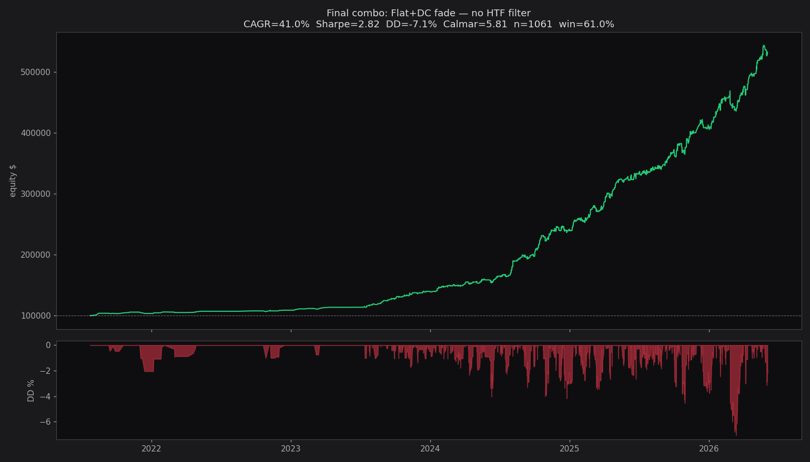
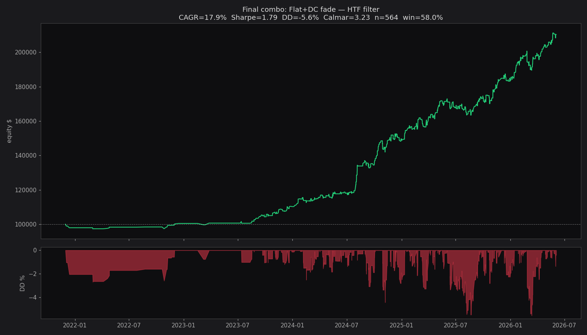

# Спринт 6.7 — Final combined strategy

**Дата:** 2026-06-04 11:14

## Стратегия

- **Flat**: fade direction, exit 20 баров или TP/SL (TP=полный ретрейс, SL=амплитуда фигуры)
- **Double Correction**: fade direction, exit 50 баров или TP/SL
- **Impulse, Triangle**: НЕ торгуем (shown as noise in Sprint 6.5)

## Вариант A: без HTF фильтра

- **n_trades:** 1061 за 4.9 лет
- **Final:** $531,265 (start $100k)
- **CAGR:** 41.0%
- **Sharpe:** 2.82
- **Max DD:** -7.1%
- **Calmar:** 5.81
- **Win rate:** 61.0%
- **Avg win / loss:** +3.54% / -1.84%

## Вариант B: только with_htf=True

- **n_trades:** 564 за 4.5 лет
- **Final:** $210,355
- **CAGR:** 17.9%
- **Sharpe:** 1.79
- **Max DD:** -5.6%
- **Calmar:** 3.23
- **Win rate:** 58.0%

## Walk-forward 5 окон (вариант A)

| fold | period | n | CAGR | Sharpe | DD | win |
|---|---|---|---|---|---|---|
| 0 | 2021-07-24 → 2024-04-09 | 212 | 16.5% | 2.35 | -2.4% | 66.0% |
| 1 | 2024-04-10 → 2024-11-05 | 212 | 105.0% | 4.18 | -4.0% | 62.7% |
| 2 | 2024-11-05 → 2025-05-07 | 212 | 72.9% | 3.54 | -4.2% | 60.4% |
| 3 | 2025-05-08 → 2025-11-11 | 212 | 37.5% | 2.06 | -4.5% | 55.7% |
| 4 | 2025-11-12 → 2026-06-02 | 213 | 71.5% | 3.25 | -7.1% | 60.1% |

## По типу фигуры (вариант A)

| type | n | CAGR | Sharpe | DD | win |
|---|---|---|---|---|---|
| flat | 941 | 21.0% | 1.80 | -7.1% | 56.6% |
| double_corr | 120 | 17.5% | 3.08 | -1.1% | 95.0% |

## По таймфрейму (вариант A)

| interval | n | CAGR | Sharpe | DD |
|---|---|---|---|---|
| 1d | 111 | 8.3% | 1.80 | -2.2% |
| 1h | 950 | 57.2% | 3.08 | -7.2% |