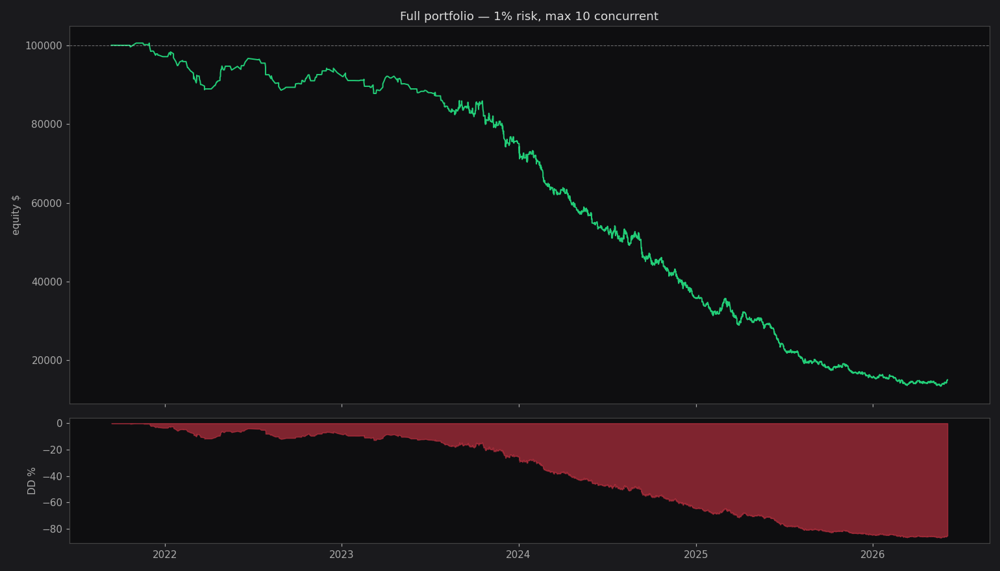
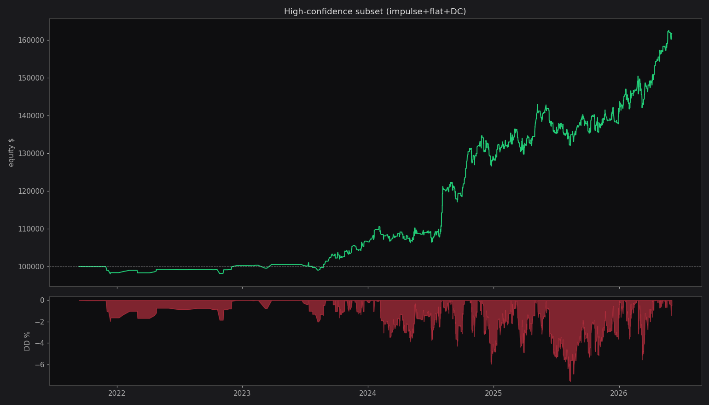
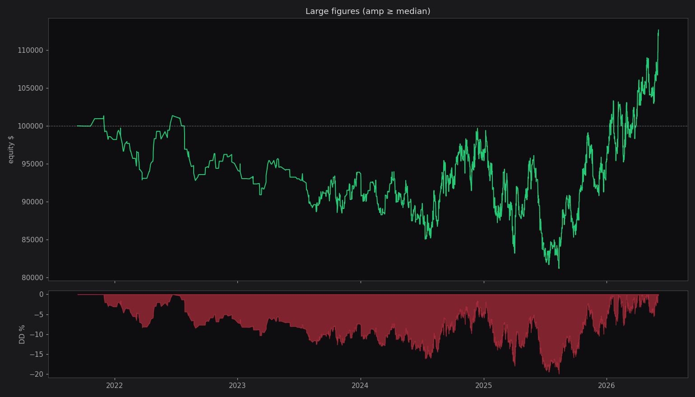
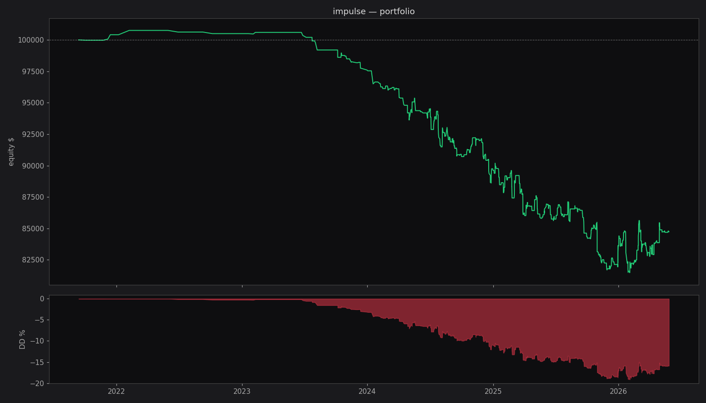
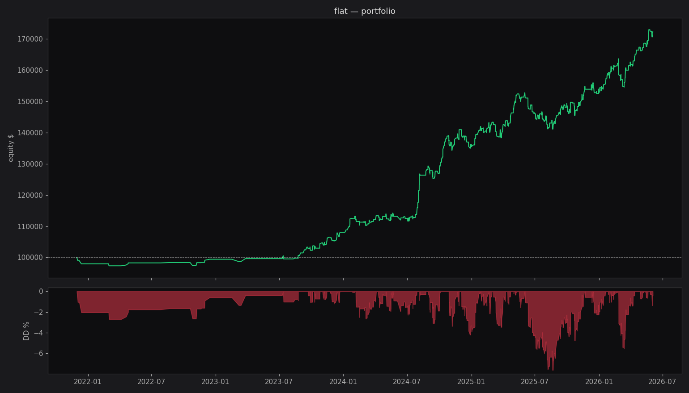
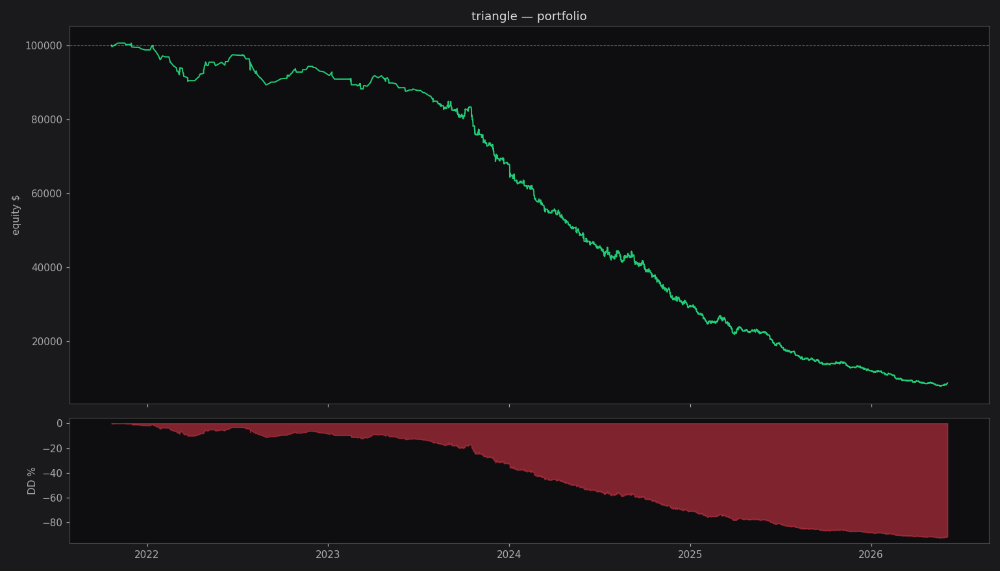
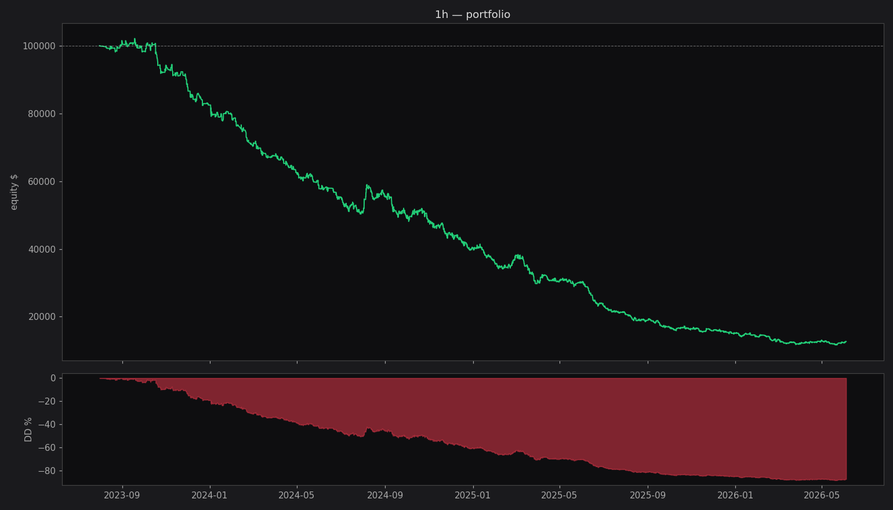
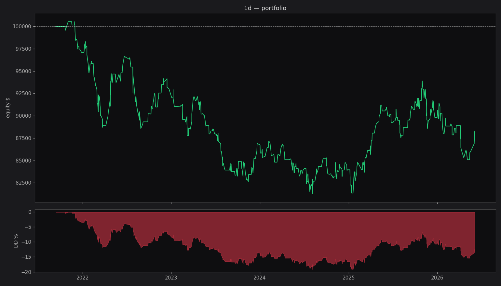

# Спринт 6 — Portfolio Backtest

**Дата:** 2026-06-04 10:47
**Капитал:** $100,000, **риск/сделка:** 1.0%, **max concurrent:** 10
**Сделки из:** trades_sprint6.parquet (4282 строк)

Position size sized from SL distance: `size = equity × risk / sl_distance`. 
Stop = entry ± amplitude фигуры. Если бы цена прошла SL — теряем 1% капитала.

## Полный портфель

final=$15,056, total=-84.9%, CAGR=-33.0%, Sharpe=-1.97, DD=-86.6%, Calmar=-0.38, n=3422, 4.7y

*Пропущено сделок (превышен лимит 10 параллельных): 860*

## По типу фигуры

| fig_type | n | final | total | CAGR | Sharpe | DD | Calmar |
|---|---|---|---|---|---|---|---|
| impulse | 453 | $84,735 | -15.3% | -3.5% | -0.66 | -19.1% | -0.18 |
| flat | 531 | $172,279 | 72.3% | 12.8% | 1.41 | -7.6% | 1.68 |
| triangle | 2994 | $8,760 | -91.2% | -41.0% | -2.83 | -92.1% | -0.44 |
| double_corr | 33 | $110,441 | 10.4% | 2.3% | 1.05 | -1.1% | 2.12 |

## По таймфрейму

| interval | n | final | total | CAGR | Sharpe | DD |
|---|---|---|---|---|---|---|
| 1d | 406 | $88,279 | -11.7% | -2.6% | -0.28 | -19.1% |
| 1h | 3734 | $12,678 | -87.3% | -51.7% | -2.78 | -88.6% |

## High-confidence subset (impulse + flat + double_corr, без triangle)

final=$161,709, total=61.7%, CAGR=10.7%, Sharpe=1.07, DD=-7.6%, Calmar=1.41, n=1013, 4.7y

## Large figures only (amp_pct ≥ median)

final=$112,669, total=12.7%, CAGR=2.6%, Sharpe=0.21, DD=-19.9%, Calmar=0.13, n=1932, 4.7y

## Графики

