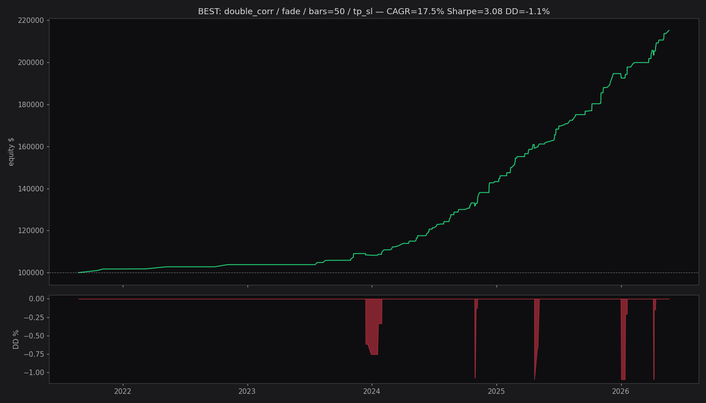

# Спринт 6.5 — Strategy variants

**Дата:** 2026-06-04 11:10

Тестируем 12 комбинаций (fade/follow × 10/20/50 bars × time/TP-SL) 
на полном 10k-датасете. Position sizing: 1% риск, max 10 параллельных.

## Главный вопрос

Triangle на fade дал Sharpe **-2.83**. Если перевернуть в **follow**, 
получим ли +Sharpe? Если да — Triangle прорывы устойчивы.

## Sharpe-таблица по подвыборкам (топ-2 строки каждой подгруппы)

```
strategy     fade                               follow                              
exit_bars      10          20          50           10          20          50      
tp_sl       False True  False True  False True   False True  False True  False True 
subset                                                                              
ALL         -0.78 -3.41  0.23 -1.60 -0.41 -0.16  -2.05 -4.34 -1.16 -3.30 -0.32 -2.46
double_corr  1.78  1.84  2.14  2.33  2.24  3.08  -2.36 -2.44 -2.44 -2.68 -2.33 -3.22
flat         0.97  1.31  1.07  1.80  0.89  1.81  -1.83 -4.46 -1.90 -4.25 -1.24 -3.87
impulse     -2.94 -3.07 -1.96 -1.97 -0.53 -0.30  -2.14 -2.41 -1.17 -1.42 -0.94 -1.28
triangle    -2.69 -4.16 -0.95 -2.42 -0.39 -0.56  -1.97 -4.26 -1.59 -3.42 -0.59 -2.71
```

## Лучшие конфигурации (по Calmar)

| subset | strategy | bars | tp_sl | n | CAGR | Sharpe | DD | Calmar | Win |
|---|---|---|---|---|---|---|---|---|---|
| double_corr | fade | 50 | tp/sl | 120 | 17.5% | 3.08 | -1.1% | 16.04 | 95.0% |
| double_corr | fade | 50 | time | 120 | 25.9% | 2.24 | -2.6% | 10.05 | 93.3% |
| double_corr | fade | 10 | time | 121 | 4.4% | 1.78 | -0.7% | 5.97 | 66.9% |
| double_corr | fade | 20 | time | 120 | 10.3% | 2.14 | -1.8% | 5.72 | 85.8% |
| double_corr | fade | 10 | tp/sl | 121 | 4.1% | 1.84 | -0.7% | 5.55 | 66.9% |
| double_corr | fade | 20 | tp/sl | 120 | 8.8% | 2.33 | -1.7% | 5.09 | 85.8% |
| flat | fade | 20 | time | 941 | 81.4% | 1.07 | -16.2% | 5.03 | 57.7% |
| flat | fade | 20 | tp/sl | 941 | 21.0% | 1.80 | -7.1% | 2.98 | 56.6% |
| flat | fade | 50 | tp/sl | 929 | 26.0% | 1.81 | -11.5% | 2.25 | 59.5% |
| flat | fade | 10 | time | 944 | 33.1% | 0.97 | -17.8% | 1.85 | 50.8% |
| flat | fade | 50 | time | 799 | 59.1% | 0.89 | -39.1% | 1.51 | 57.7% |
| flat | fade | 10 | tp/sl | 948 | 11.3% | 1.31 | -9.6% | 1.18 | 49.8% |
| ALL | fade | 20 | time | 2232 | 5.2% | 0.23 | -39.5% | 0.13 | 45.4% |
| ALL | fade | 50 | tp/sl | 1520 | -2.9% | -0.16 | -30.7% | -0.10 | 48.6% |
| impulse | fade | 50 | tp/sl | 1059 | -3.3% | -0.30 | -23.9% | -0.14 | 48.7% |
| impulse | fade | 50 | time | 985 | -5.6% | -0.53 | -33.0% | -0.17 | 48.7% |
| triangle | fade | 50 | tp/sl | 1693 | -9.1% | -0.56 | -46.0% | -0.20 | 46.1% |
| triangle | fade | 50 | time | 995 | -14.7% | -0.39 | -68.8% | -0.21 | 46.7% |
| impulse | follow | 50 | time | 985 | -9.8% | -0.94 | -45.2% | -0.22 | 43.6% |
| ALL | follow | 50 | time | 1088 | -15.6% | -0.32 | -68.3% | -0.23 | 43.1% |

## Triangle: fade vs follow

| bars | tp_sl | fade Sharpe | follow Sharpe | fade CAGR | follow CAGR |
|---|---|---|---|---|---|
| 10 | time | -2.69 | -1.97 | -53.5% | -42.3% |
| 10 | tp/sl | -4.16 | -4.26 | -53.4% | -53.9% |
| 20 | time | -0.95 | -1.59 | -27.1% | -40.3% |
| 20 | tp/sl | -2.42 | -3.42 | -34.1% | -44.4% |
| 50 | time | -0.39 | -0.59 | -14.7% | -18.9% |
| 50 | tp/sl | -0.56 | -2.71 | -9.1% | -35.5% |

## Equity лучшей конфигурации

